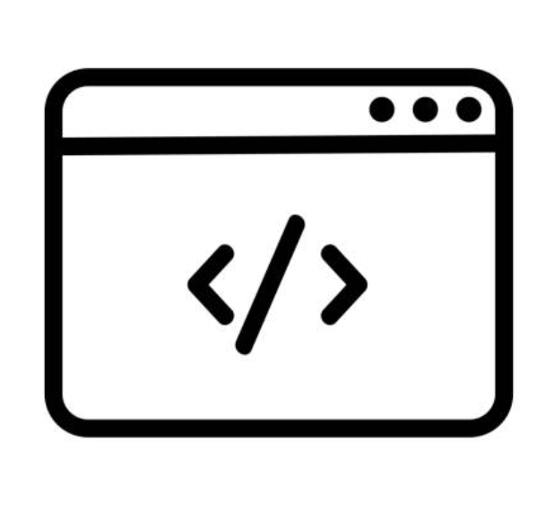

<!-- Improved compatibility of back to top link: See: https://github.com/othneildrew/Best-README-Template/pull/73 -->

<!-- PROJECT SHIELDS -->
<!--
*** I'm using markdown "reference style" links for readability.
*** Reference links are enclosed in brackets [ ] instead of parentheses ( ).
*** See the bottom of this document for the declaration of the reference variables
*** for contributors-url, forks-url, etc. This is an optional, concise syntax you may use.
*** https://www.markdownguide.org/basic-syntax/#reference-style-links
-->

[![Contributors][contributors-shield]][contributors-url]
[![Forks][forks-shield]][forks-url]
[![Stargazers][stars-shield]][stars-url]
[![Issues][issues-shield]][issues-url]
[![MIT License][license-shield]][license-url]
[![LinkedIn][linkedin-shield]][linkedin-url]

<!-- PROJECT LOGO -->
 

  

<h3 align="center">project_title</h3>

  

    A repository containing my solutions to the Advent of Code 2022. An Advent calendar of small programming puzzles.
     
    <a href="https://github.com/jamestkelly/advent-of-code-2022"><strong>Explore the docs »</strong></a>
     
     
    <a href="https://github.com/jamestkelly/advent-of-code-2022">View Demo</a>
    ·
    <a href="https://github.com/jamestkelly/advent-of-code-2022/issues">Report Bug</a>
    ·
    <a href="https://github.com/jamestkelly/advent-of-code-2022/issues">Request Feature</a>
  

<!-- TABLE OF CONTENTS -->

  
Table of Contents

  <ol>
    <li>
      <a href="#about-the-project">About The Project</a>
      <ul>
        <li><a href="#built-with">Built With</a></li>
      </ul>
    </li>
    <li>
      <a href="#getting-started">Getting Started</a>
    </li>
    <li><a href="#contributing">Contributing</a></li>
    <li><a href="#license">License</a></li>
    <li><a href="#contact">Contact</a></li>
  </ol>

<!-- ABOUT THE PROJECT -->

## About The Project

This repository houses my solutions to the Advent of Code 2022. An Advent calendar of small programming puzzles. This
_advent calendar_ is accessible from the [Advent of Code 2022](https://adventofcode.com/2022).

(<a href="#readme-top">back to top</a>)

### Built With

- [Python3](https://www.python.org/)

(<a href="#readme-top">back to top</a>)

<!-- GETTING STARTED -->

## Getting Started

This project is a mono-repository containing several micro-projects which will each have a corresponding `README.md`
contained within them.

<!-- CONTRIBUTING -->

## Contributing

Contributions are what make the open source community such an amazing place to learn, inspire, and create. Any
contributions you make are **greatly appreciated**.

If you have a suggestion that would make this better, please fork the repo and create a pull request. You can also
simply open an issue with the tag "enhancement".
Don't forget to give the project a star! Thanks again!

1. Fork the Project
2. Create your Feature Branch (`git checkout -b feature/AmazingFeature`)
3. Commit your Changes (`git commit -m 'Add some AmazingFeature'`)
4. Push to the Branch (`git push origin feature/AmazingFeature`)
5. Open a Pull Request

(<a href="#readme-top">back to top</a>)

<!-- LICENSE -->

## License

Distributed under the MIT License. See `LICENSE.txt` for more information.

(<a href="#readme-top">back to top</a>)

<!-- CONTACT -->

## Contact

Jim Kelly

Project Link: [https://github.com/jamestkelly/advent-of-code-2022](https://github.com/jamestkelly/advent-of-code-2022)

(<a href="#readme-top">back to top</a>)

<!-- MARKDOWN LINKS & IMAGES -->
<!-- https://www.markdownguide.org/basic-syntax/#reference-style-links -->

[contributors-shield]: https://img.shields.io/github/contributors/jamestkelly/advent-of-code-2022.svg?style=for-the-badge

[contributors-url]: https://github.com/jamestkelly/advent-of-code-2022/graphs/contributors

[forks-shield]: https://img.shields.io/github/forks/jamestkelly/advent-of-code-2022.svg?style=for-the-badge

[forks-url]: https://github.com/jamestkelly/advent-of-code-2022/network/members

[stars-shield]: https://img.shields.io/github/stars/jamestkelly/advent-of-code-2022.svg?style=for-the-badge

[stars-url]: https://github.com/jamestkelly/advent-of-code-2022/stargazers

[issues-shield]: https://img.shields.io/github/issues/jamestkelly/advent-of-code-2022.svg?style=for-the-badge

[issues-url]: https://github.com/jamestkelly/advent-of-code-2022/issues

[license-shield]: https://img.shields.io/github/license/jamestkelly/advent-of-code-2022.svg?style=for-the-badge

[license-url]: https://github.com/jamestkelly/advent-of-code-2022/blob/master/LICENSE.txt

[linkedin-shield]: https://img.shields.io/badge/-LinkedIn-black.svg?style=for-the-badge&logo=linkedin&colorB=555

[linkedin-url]: https://linkedin.com/in/jimkellyt
